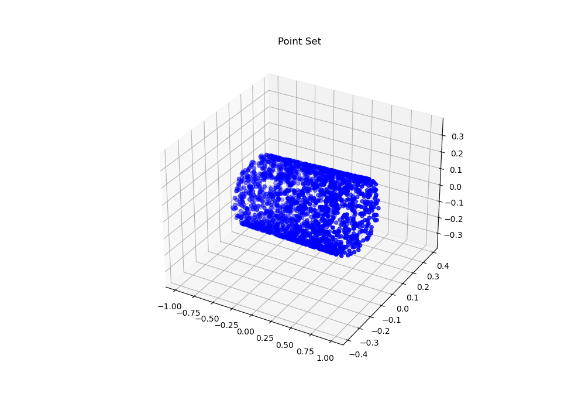

# PointNet TP for UCBL DISS ImageMachineLearning Class

Replicating PointNet described by the paper: [PointNet: Deep Learning on Point Sets for 3D Classification and Segmentation](https://arxiv.org/abs/1612.00593).  

Sample cylinder point cloud:  

## Files
- [prepare_data.py](prepare_data.py) — Point cloud data generation for cylinders, rectangular parallelepipeds, and toruses.
- [pointnet.py](pointnet.py) — PointNet implementation.

## Overview
- Criterion: negative log likelihood loss (NLL), typical for classification with several classes.
- T-Net: learning and predicting a transformation matrix applied to the data to align inputs
  - invariant to permutations (order shouldn't matter) - use max pooling as a symmetric function to aggregate information from all the points
  - invariant to transformations (shift/rotate) - transform the data into a canonical form
- MaxPooling: represent an input as set of its maximal features
  - we lose individual point locations & local relationships
  - in exchange for invariance to permutation, viewing an object as a sum of its parts
- PointNet includes:
  - TNet1 (3x3): Fixes geometric issues (rotation, translation) in the original point cloud
  - TNet2 (64x64): Fixes alignment issues in the learned feature representation, which captures more abstract patterns
  - Conv1d: feature extraction from each individual point
  - FC layers
 

## Helpful Links
- [PointNet Explained Visually](https://datascienceub.medium.com/pointnet-implementation-explained-visually-c7e300139698)
- [An In-Depth Look at PointNet](https://medium.com/@luis_gonzales/an-in-depth-look-at-pointnet-111d7efdaa1a)

